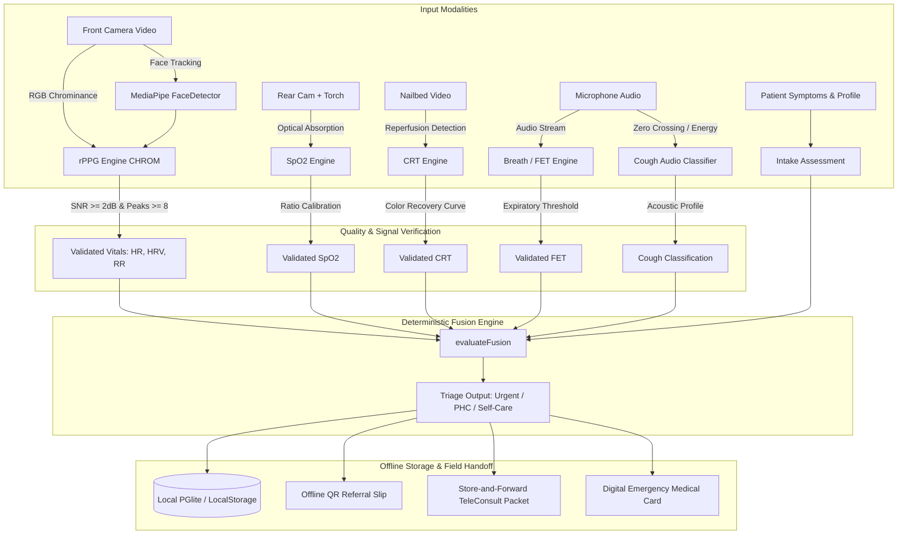

# Univolt (UniCare) — Field Vitals Kit

<p align="center">
  
</p>

<p align="center">
  <strong>Offline-First · Edge AI · Smartphone-Powered Clinical Vitals & Triage Station</strong>
</p>

<p align="center">
  
  
  
  
  
  
  
</p>

---

## 📋 Overview

**Univolt** (also known as **UniCare**) is an edge-AI clinical diagnostics and vitals screening platform engineered specifically for **community health workers (ASHA, ANM, rural nurses, field volunteers)** operating in remote, low-resource, or zero-connectivity catchments.

Traditional clinical screening requires expensive, battery-dependent pulse oximeters, blood pressure cuffs, and ECG monitors that are difficult to supply and maintain in rural field settings. **Univolt transforms standard commodity smartphones or tablets into a multi-modal triage station**, measuring physiological signals through the device's native camera and microphone—without requiring external medical peripherals or active internet access.

```
┌─────────────────────────────────────────────────────────────────────────────┐
│                            UNIVOLT EDGE SUITE                               │
│                                                                             │
│  [Front Camera]   ──►  Remote Photoplethysmography (HR, HRV, RR via CHROM)  │
│  [Rear Camera+LED]──►  Contact Fingertip Pulse Oximetry (% SpO₂)            │
│  [Video Analysis] ──►  Capillary Refill Time (CRT Nailbed Blanching)        │
│  [Microphone]     ──►  Forced Expiratory Time (FET) & Cough Sound Screening │
│  [Touch/Vision]   ──►  Emergency Gesture Recognition & Non-Verbal Intake    │
│                                      │                                      │
│                                      ▼                                      │
│                 DETERMINISTIC CLINICAL FUSION ENGINE                        │
│                 (Urgent · PHC Today · Self Care · Inconclusive)             │
│                                      │                                      │
│                                      ▼                                      │
│            Offline QR Referral Slips & Tele-Consult Store-Forward           │
└─────────────────────────────────────────────────────────────────────────────┘
```

---

## ⚡ Key Capabilities & Edge AI Modules

### 1. 📷 Contactless Face rPPG (Remote Photoplethysmography)
- **Zero Contact Measurement**: Extracts vital signs from subtle facial micro-color pulsations using MediaPipe Face Tracking (`blaze_face_short_range.tflite`).
- **Signal Pipeline**:
  - **CHROM (Chrominance-based method)** algorithm isolates hemoglobin absorption from ambient illumination variations.
  - Cascaded **single-pole IIR highpass (0.7 Hz) and lowpass (3.0 Hz)** bandpass filtering (42–180 BPM passband).
  - Dual-mode verification: **Goertzel spectral frequency analysis** cross-referenced with **time-domain inter-beat peak detection**.
- **Metrics Extracted**:
  - **Heart Rate (BPM)**
  - **Heart Rate Variability (HRV RMSSD)**
  - **Respiratory Rate (RR)**
- **Strict Quality Gating**: Spectral SNR threshold ($\ge 2.0\text{ dB}$) and minimum 8-beat consistency. Rejects motion artifacts instead of reporting hallucinated numbers.

### 2. 🔴 Contact Fingertip SpO₂ Estimation
- Rear camera + LED torch optical pulse oximeter.
- Analyzes red-to-green/blue AC/DC light attenuation ratios during capillary blood pulsation.
- Fallback manual entry supported for certified medical pulse oximeters.

### 3. ⏱️ Capillary Refill Time (CRT) Video Analysis
- Rapid hemodynamic assessment for hypovolemia, dehydration, and early shock.
- Records video of nailbed compression, detects the release event, and calculates reperfusion latency (normal $\le 2\text{s}$, borderline $3\text{–}4\text{s}$, abnormal $\ge 5\text{s}$).

### 4. 🫁 Forced Expiratory Time (FET) & Acoustic Cough Screening
- **Forced Expiratory Time (FET)**: Analyzes sustained exhalation audio through the device microphone to detect airflow limitation ($\ge 6\text{s}$ indicates potential obstructive pulmonary disease such as COPD or asthma).
- **Cough Audio Classifier**: Computes zero-crossing rates (ZCR) and spectral energy variance to identify abnormal acoustic patterns and trigger clinical review flags.

### 5. 🧠 Deterministic Multi-Modal Fusion Engine
- Pure deterministic clinical rule engine (`src/lib/fusionEngine.ts`) with zero black-box hallucination.
- Aggregates **rPPG**, **SpO₂**, **CRT**, **FET**, **age**, **pregnancy status**, and **acute danger symptoms** (chest pain, severe breathlessness, fainting, uncontrolled bleeding).
- Categorizes triage priority:
  - 🔴 **`urgent`**: Immediate emergency stabilization / tertiary hospital escalation.
  - 🟡 **`phc_today`**: Primary Health Centre evaluation required within 24 hours.
  - 🟢 **`self_care`**: Stable vitals, symptomatic relief, and home observation.
  - ⚪ **`insufficient_data`**: Sensor readings rejected; re-test guided.

### 6. 🏥 Clinic Staff Tablet View & Store-and-Forward Tele-Consultation
- Accessible via `/staff`:
  - Catchment-wide patient roster sorted urgent-first.
  - **Store-and-Forward Tele-consultation Queue**: Generates compressed plain-text consult packets for transmission over low-bandwidth channels (SMS, WhatsApp, radio).
  - Full offline database backup, export, and import via clean JSON records.

### 7. 📄 Offline QR Referral Slips & Emergency Health Cards
- Generates high-density QR code referral slips (`/referral`) encoding patient demographics, baseline vitals, and triage rationales.
- PHC medical officers can scan and ingest patient records offline without server dependencies.
- **Emergency Cards (`/emergency/:id`)**: Instant access to blood group, drug allergies, active chronic conditions, and emergency contacts.

### 8. ♿ Accessibility & Non-Verbal Communication
- **Gesture Recognition**: MediaPipe Gesture Recognizer (`gesture_recognizer.task`) for emergency signaling when patients cannot speak.
- **Pictographic Intake**: Visual symptom picker for patients with limited literacy or hearing impairments.
- **Audio Guidance & TTS**: Localized spoken instructions and health literacy summaries (`SpeakerButton`).

### 9. 🌐 Multilingual & Regional Health Context
- First-class support for **6 Indian languages**:
  - English (`en`)
  - Hindi (`hi` — हिन्दी)
  - Bengali (`bn` — বাংলা)
  - Telugu (`te` — తెలుగు)
  - Tamil (`ta` — தமிழ்)
  - Marathi (`mr` — मराठी)
- **District Disease Advisories (`/awareness`)**: Seasonal alerts for vector-borne diseases, heatwaves, and water-borne outbreaks.
- **Welfare Schemes Finder (`/schemes`)**: Eligibility guidelines for Ayushman Bharat (PM-JAY) and regional state assistance programs.

---

## 🏗️ Architecture



---

## 📂 Project Structure

```
univolt/
├── public/
│   ├── models/                    # Edge AI TFLite & Task models
│   │   ├── blaze_face_short_range.tflite # MediaPipe Face Detection
│   │   └── gesture_recognizer.task      # MediaPipe Gesture Recognition
│   ├── favicon.svg                # Brand icon
│   └── sw.js                      # Progressive Web App (PWA) Service Worker
├── src/
│   ├── components/                # Reusable UI & accessibility components
│   │   ├── app-shell.tsx          # Mobile container & sticky app headers
│   │   ├── communication/         # Gesture, pictographs & TTS speaker button
│   │   └── ui/                    # Accessible Radix UI primitives & buttons
│   ├── lib/
│   │   ├── advisories.ts          # District-level regional health advisories
│   │   ├── awareness.ts           # Health literacy content cards
│   │   ├── breathAudioEngine.ts   # Forced Expiratory Time (FET) audio analyzer
│   │   ├── consultPacket.ts       # Low-bandwidth tele-consult message builder
│   │   ├── crtEngine.ts           # Capillary Refill Time computer vision engine
│   │   ├── faceDetector.ts        # MediaPipe Vision face detection wrapper
│   │   ├── fusionEngine.ts        # Multi-modal deterministic triage fusion
│   │   ├── gestureRecognizer.ts   # Hand gesture tracking pipeline
│   │   ├── priority.ts            # Triage priority color tagging & meta
│   │   ├── referralSlip.ts        # QR code & printable referral slips
│   │   ├── rppgEngine.ts          # Contactless camera rPPG signal processor
│   │   ├── schemes.ts             # Ayushman Bharat & government health schemes
│   │   ├── spo2Engine.ts          # Contact rear camera pulse oximetry engine
│   │   ├── translations.ts        # Multilingual strings (EN, HI, BN, TE, TA, MR)
│   │   ├── triage.ts              # Clinical vital boundary rules
│   │   └── univolt/               # Local DB state management & Zustand stores
│   ├── routes/                    # TanStack Router screens
│   │   ├── index.tsx              # Field Roster & Catchment Home
│   │   ├── register.tsx           # New patient registration & intake
│   │   ├── patient.$id.index.tsx  # Patient record, history & longitudinal vitals
│   │   ├── patient.$id.scan.tsx   # Live camera rPPG scan screen
│   │   ├── patient.$id.cough.tsx  # Cough acoustic screening screen
│   │   ├── patient.$id.intake.tsx # Accessibility & pictographic symptom intake
│   │   ├── emergency.$id.tsx      # Emergency digital health card & triage view
│   │   ├── staff.tsx              # Shared clinic tablet hub & tele-consult queue
│   │   ├── awareness.tsx          # Health awareness & seasonal advisories
│   │   ├── schemes.tsx            # Government subsidy & scheme search
│   │   └── debug.tsx              # 5-point live face rPPG diagnostics tool
│   ├── screens/                   # High-level full-screen flow components
│   └── styles.css                 # Design tokens & Tailwind CSS v4 styling
├── fusionEngine.test.ts           # Unit & acceptance test suite for Fusion Engine
├── package.json                   # Project dependencies and script definitions
├── tsconfig.json                  # TypeScript configuration
└── vite.config.ts                 # Vite bundler & PWA configuration
```

---

## 🚀 Getting Started

### Prerequisites
- **Node.js**: `v20.0.0` or higher
- **npm** or **pnpm**
- Modern Web Browser with WebRTC Camera and Audio Permissions (Chrome, Edge, Safari, Firefox)

### Installation

1. **Clone the repository**:
   ```bash
   git clone https://github.com/Krisbtw/univolt.git
   cd univolt
   ```

2. **Install dependencies**:
   ```bash
   npm install
   ```

3. **Start the local development server**:
   ```bash
   npm run dev
   ```
   Open your browser and navigate to **`http://localhost:8080`**.

---

## 🛠️ Development & Testing

### Running Tests
Execute the deterministic fusion acceptance tests and integration test suites:
```bash
# Run fusionEngine acceptance test suite
npx tsx fusionEngine.test.ts

# Run the complete test suite
npm run test
```

### Type Checking & Linting
```bash
# TypeScript compiler check
npm run typecheck

# Code quality linting
npm run lint

# Format code with Prettier
npm run format
```

### Production Build
```bash
npm run build
npm run preview
```

---

## 🩺 Clinical Reference & Normal Ranges

| Vital Parameter | Modality | Normal Range | Review / Flag Range | Urgent / Emergency Trigger |
| :--- | :--- | :--- | :--- | :--- |
| **Heart Rate (HR)** | Face rPPG Camera | `60 – 100 BPM` | `< 60` or `101 – 120 BPM` | `> 120 BPM` (Tachy) or `< 50 BPM` (Brady) |
| **Respiratory Rate (RR)** | Face rPPG / Audio | `12 – 20 Br/min` | `21 – 24 Br/min` | `> 24 Br/min` (Tachypnea) or `< 10 Br/min` |
| **SpO₂ (Blood Oxygen)** | Rear Cam Torch / Oximeter | `95% – 100%` | `90% – 94%` (Mild Hypoxia) | `< 90%` (Severe Hypoxia) |
| **Capillary Refill (CRT)**| Nailbed Video Reperfusion | `< 2.0 s` | `3.0 – 4.0 s` (Borderline) | `≥ 5.0 s` (Severe Hypoperfusion) |
| **Forced Expiratory (FET)**| Microphone Audio | `< 4.0 s` | `4.0 – 5.9 s` | `≥ 6.0 s` (Airway Obstruction) |
| **HRV (RMSSD)** | Face rPPG Camera | `> 25 ms` | `15 – 25 ms` | `< 15 ms` (Severe autonomic distress) |

---

## 🔒 Privacy, Security & Data Sovereignty

- **100% On-Device Processing**: Video feeds and audio recordings are processed exclusively inside browser memory via WebAssembly and WebGL. **No images, video streams, or raw voice recordings are ever sent to an external server.**
- **Zero Cloud Dependence**: The application functions without internet. All data is persisted locally in `PGlite` / `localStorage`.
- **Decentralized Data Transfer**: Patient handoffs between field workers and Primary Health Centres occur via peer-to-peer visual QR codes or encrypted local file exports.
- **Privacy by Design**: Identifying information is decoupled from diagnostic referral packets.

---

## 🤝 Contributing

Contributions to Univolt are warmly welcomed! Whether you are a biomedical engineer, machine learning practitioner, clinician, or frontend developer:

1. Fork the repository
2. Create your feature branch (`git checkout -b feature/amazing-feature`)
3. Ensure all tests pass (`npx tsx fusionEngine.test.ts && npm run typecheck`)
4. Commit your changes (`git commit -m 'feat: add support for pediatric triage ranges'`)
5. Push to the branch (`git push origin feature/amazing-feature`)
6. Open a Pull Request

---

<p align="center">
  Built with ❤️ for community health workers and frontline healthcare champions worldwide.
</p>
